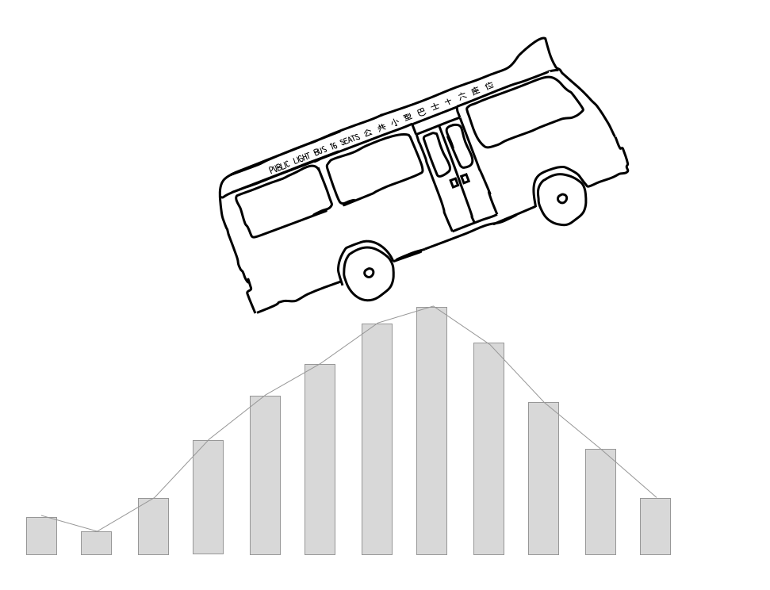

.. toctree::
    :maxdepth: 2
    :hidden:

    intro.Rmd
    intro_sql_basic.ipynb
    intro_sql_interm.ipynb
    developer/index.rst

.. toctree::
    :maxdepth: 2
    :caption: Core One-table Verbs
    :hidden:
    :glob:

    api_table_core/*

.. toctree::
    :maxdepth: 2
    :caption: Other One-table Verbs
    :hidden:
    :glob:

    api_table_other/*

.. toctree::
    :maxdepth: 2
    :caption: Two-table Verbs
    :hidden:
    :glob:

    api_table_two/*

.. toctree::
    :maxdepth: 2
    :caption: Tidy Verbs
    :hidden:
    :glob:

    api_tidy/*

Siuba
=====

Siuba is a library for quick, scrappy data analysis in Python.
It is a port of
`dplyr <https://dplyr.tidyverse.org>`_,
`tidyr <https://tidyr.tidyverse.org>`_,
and other R Tidyverse libraries.

Getting started:

* Introduction to Siuba
* tidytuesday-py examples
